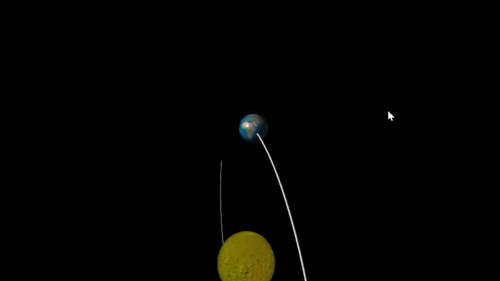
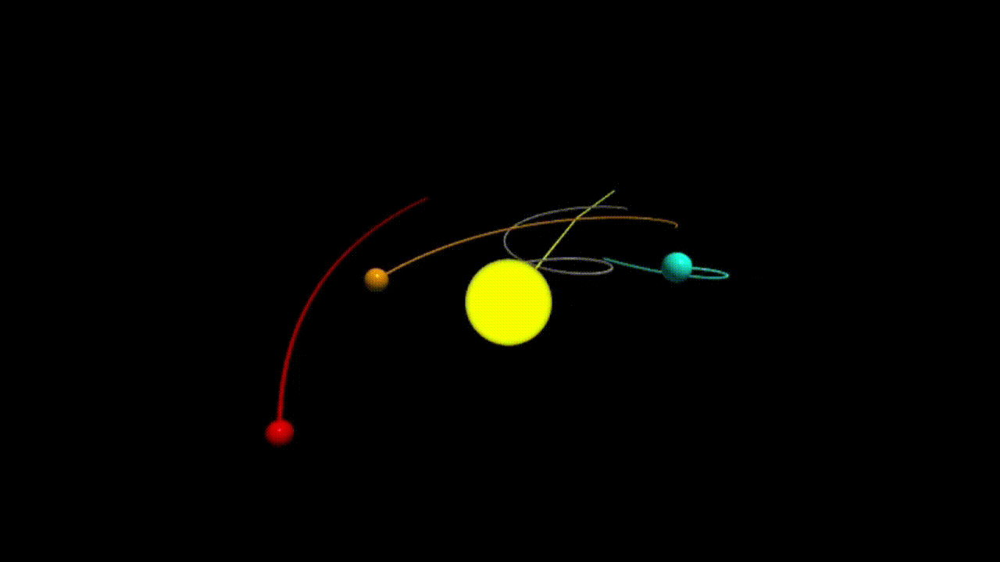

# gravitacion-universal
Simulaciones desarrolladas en Python para estudiar la ley de gravitación universal y los movimientos orbitales. A través de modelos numéricos y visualizaciones. Se exploran distintos escenarios del sistema solar y de la dinámica galáctica.
## Contenido
1.  **Sistema Sol - Tierra**
- Una simulación de la Tierra orbitando alrededor del Sol en una trayectoria elíptica. Ejemplifica cómo la segunda ley de Kepler se traduce en velocidades variables a lo largo de una órbita.
2.  **Sistema Sol - Tierra - Luna**
- Sistema de tres cuerpos que muestra la órbita de la Luna alrededor de la Tierra, mientras orbitan alrededor del Sol. Se aprecian perturbaciones y la complejidad del movimiento.

3. **Sistema Solar en la Galaxia**
- Varios planetas orbitando el Sol mientras este se desplaza por la galaxia. Son trayectorias en forma de espiral, representando el viaje conjunto de nuestro sistema solar.

 
## Instalación
Clona este repositorio en tu máquina local, simplemente:

```bash
git clone https://github.com/tuusuario/gravitacion-universal.git
cd gravitacion-universal
```
Luego, instala las dependencias usando pip:
```bash
pip install -r requirements.txt
```
## Ejecuación
Cada archivo corresponde a una simulación distinta, para ejecutarlo escribimos python seguido del archivo que deseamos ejecutar:
```bash
python tierra_sol.py
python sol_tierra_luna.py
python sistema_solar_galaxia.py
```
## Ejemplo de lo que verás
- Tierra-Sol



- Sol-Tierra-Luna


- Sistema solar con movimiento galáctico


## Tecnologías utilizadas
Python
NumPy
Matplotlib
VPython

